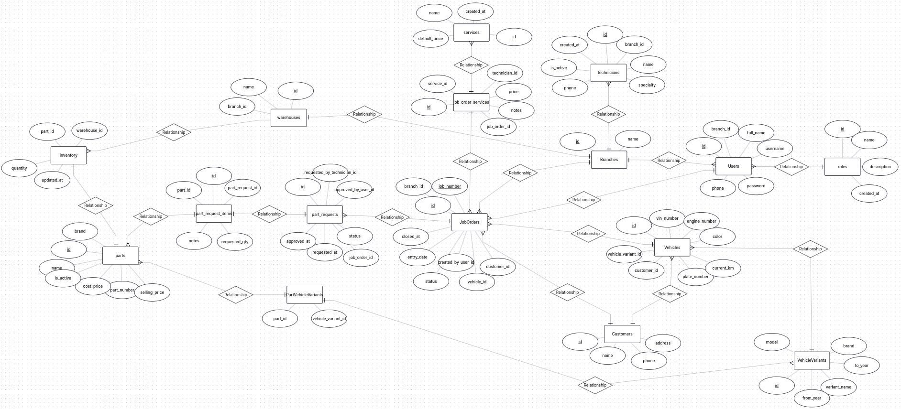

# EAIC ERP

> Enterprise Resource Planning (ERP) system for automotive workshops built with Spring Boot and MySQL.

EAIC ERP is a backend application designed to manage the daily operations of automotive service centers, including customers, vehicles, job orders, inventory, spare parts, warehouses, technicians, and system users.

The project follows a layered architecture and is being developed using modern Spring Boot best practices with scalability and maintainability in mind.

---

# Database Design

The project started with a complete database design before writing any code.

<p align="center">
  
</p>

---

# Features

### Customer Management
- Register customers
- Customer vehicle history

### Vehicle Management
- Vehicle variants
- VIN & Engine tracking
- Mileage management

### Workshop Operations
- Job Orders
- Assigned technicians
- Workshop services

### Inventory Management
- Spare parts
- Warehouses
- Stock quantities
- Part compatibility with vehicle variants

### Parts Requests
- Request workflow
- Approval process
- Inventory integration

### User Management
- Users
- Roles
- Branches

---

# 🏗️ Architecture

```
Controller
     │
Service
     │
Repository
     │
 Database
```

The project follows a layered architecture to ensure clean separation of concerns and maintainability.

---

# 🛠️ Tech Stack

| Technology | Description |
|------------|-------------|
| Java 25 | Programming Language |
| Spring Boot | Backend Framework |
| Spring Data JPA | ORM |
| Hibernate | Persistence |
| MySQL | Database |
| Maven | Dependency Management |
| Lombok | Boilerplate Reduction |
| Jakarta Validation | Validation |

---

# 📂 Project Structure

```
src/main/java/com/eaic/erp

├── entity
│   ├── inventory
│   ├── Customer
│   ├── Vehicle
│   ├── VehicleVariant
│   ├── JobOrder
│   ├── JobOrderService
│   ├── PartRequest
│   ├── User
│   └── ...
│
├── repository
├── service
├── controller
├── dto
├── config
├── exception
└── security
```

---

# 🚧 Current Progress

- ✅ Database Design
- ✅ ERD
- ✅ JPA Entities
- ✅ Entity Relationships
- ✅ Composite Keys
- ✅ Spring Data Repositories

---

# 📌 Roadmap

- [x] Database Design
- [x] Entity Modeling
- [x] Repository Layer
- [ ] Service Layer
- [ ] DTO Mapping
- [ ] Validation
- [ ] REST APIs
- [ ] Exception Handling
- [ ] Authentication (JWT)
- [ ] Authorization
- [ ] Swagger Documentation
- [ ] Unit Testing
- [ ] Docker
- [ ] Deployment

---

